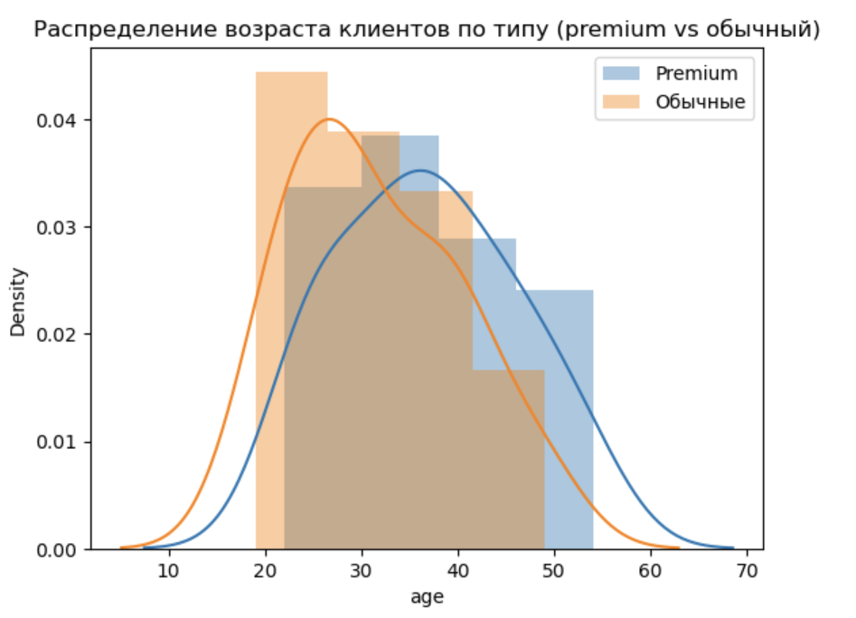

# Анализ пользовательских данных: успешные операции и предпочтения клиентов

## Описание задачи

Мини-проект по анализу пользовательских данных компании, предоставляющей услуги через несколько платформ (web, mobile, desktop).

Представим ситуацию: я — аналитик компании. Мне поручено изучить поведение клиентов и выявить закономерности, которые помогут в оптимизации бизнес-процессов.

## Цель проекта

- Изучить предпочтения премиумных и обычных клиентов
- Проанализировать распределение успешных операций и возраста клиентов
- Визуализировать ключевые метрики, влияющие на поведение пользователей

## Реализация

- Провела EDA: размеры таблиц, пропуски, типы данных, описательная статистика
- Определила:
  - клиента с наибольшим количеством успешных операций
  - самую «продуктивную» платформу
- Визуализировала:
  - распределение возраста по типу клиента
  - число успешных операций
  - предпочтения по платформам

Использованные инструменты: `pandas`, `seaborn`, `matplotlib`.

---

## 🧾 Описание данных

### `user_data.csv`

| Поле      | Описание                                      |
|-----------|-----------------------------------------------|
| `client`  | Идентификатор пользователя                    |
| `premium` | Признак премиум-клиента (`True` / `False`)    |
| `age`     | Возраст клиента                               |

### `logs.csv`

| Поле      | Описание                                      |
|-----------|-----------------------------------------------|
| `client`  | Идентификатор пользователя                    |
| `success` | Результат действия (`1` — успех, `0` — неуспех) |
| `platform`| Платформа: `desktop`, `mobile`, `web`         |
| `time`    | Время события (Unix timestamp)                |

---

## Примеры визуализаций

### Распределение возраста клиентов по типу (premium vs обычные)

🔍 Премиум-пользователи чаще встречаются в возрастной категории **30–40 лет**,  
в то время как обычные — в основном до **30 лет**.

---

### Количество успешных действий по платформам

💡 **Пользователи desktop-платформ** совершают больше успешных действий.  
Премиум-клиенты чаще используют **web** и **mobile**.

---

## Основные выводы

- **Desktop** — лидирует по количеству успешных действий.
- Пользователи от **25 лет** — наиболее активны.
- Среди премиум-клиентов преобладают пользователи **30–40 лет**, они совершают больше целевых действий.
- Предпочтения по платформам отличаются в зависимости от сегмента.

---

## 📎 Стек

- **Python**: pandas, seaborn, matplotlib
- **Навыки**: EDA, группировки, фильтрация, визуализация
- **Среда**: Jupyter Notebook, GitHub
